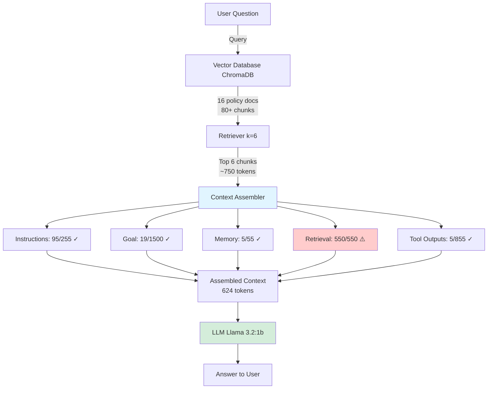
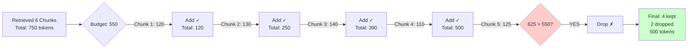
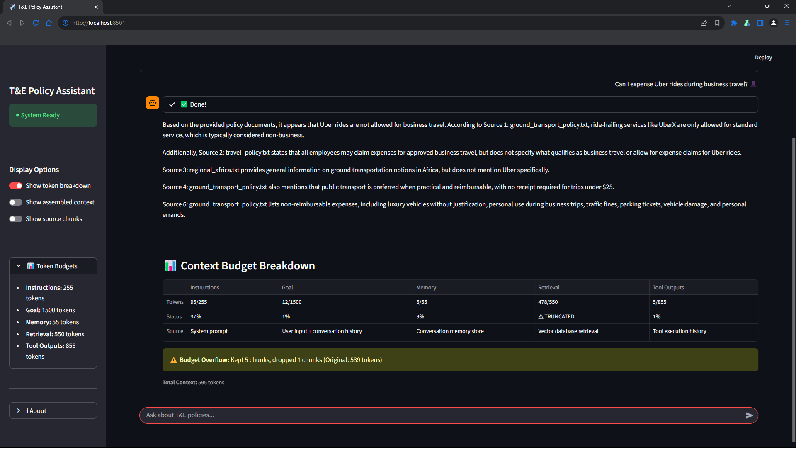
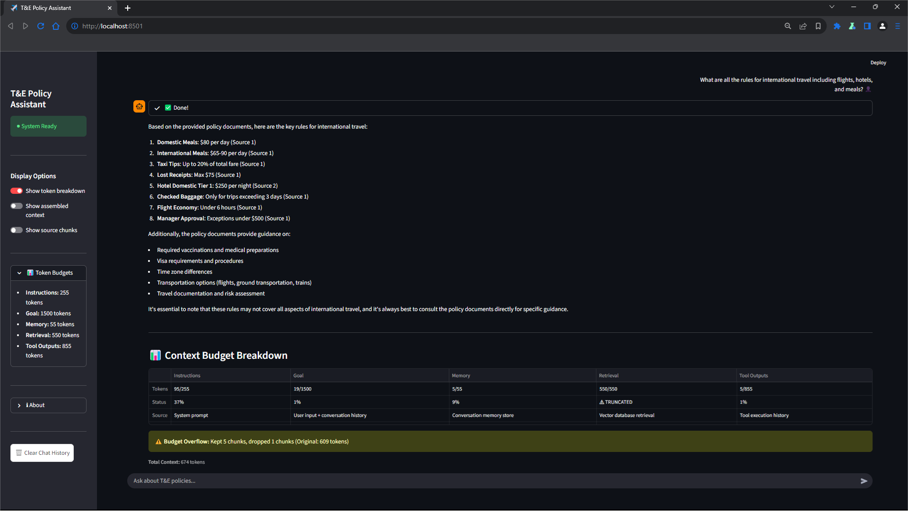

# Context-Window-Aware RAG System

A Retrieval-Augmented Generation (RAG) system that explicitly manages
LLM context using fixed token budgets, prioritization rules, and
deliberate truncation strategies.

This project demonstrates context economics, instruction hierarchy,
and controlled retrieval under constrained context windows.

---

## Overview

This project implements a **Context-Window-Aware Retrieval-Augmented Generation (RAG)** system that explicitly manages how information is assembled into an LLM’s context window.

Rather than treating the context window as an unbounded prompt, the system enforces **fixed token budgets per context section**, with clear prioritization and truncation rules. When the available context exceeds these budgets, the system deliberately drops or truncates lower-priority information while preserving higher-priority instructions and user intent.

The primary goal of this project is not to maximize recall, but to demonstrate:

- Context economics under scarcity
- Instruction hierarchy and priority enforcement
- Deliberate retrieval truncation
- Transparent and observable context assembly

The system includes both a **CLI interface** and a **minimal Streamlit web UI**, making it easy to inspect retrieval behavior, token usage, and budget overflows during execution.


## Architecture

The system follows a standard RAG pipeline, with an explicit **context assembly stage** that enforces token budgets and prioritization before invoking the LLM.

### High-Level System Flow

```text
User (CLI / Streamlit)
        |
        v
┌────────────────────────┐
│ User Question          │
└───────────┬────────────┘
            v
┌────────────────────────┐
│ Vector Retrieval       │
│ Chroma + Embeddings    │
│ (Top-k semantic chunks)│
└───────────┬────────────┘
            v
┌────────────────────────────────────┐
│ Context Assembly Engine             │
│                                    │
│  • Instructions   (255 tokens)     │
│  • Goal           (1500 tokens)    │
│  • Memory         (55 tokens)      │
│  • Retrieval      (550 tokens)     │
│  • Tool Outputs   (855 tokens)     │
│                                    │
│  → Enforces hard budgets           │
│  → Prioritizes & truncates content │
└───────────┬────────────────────────┘
            v
┌────────────────────────┐
│ LLM (Ollama)           │
│ llama3.2:1b            │
└───────────┬────────────┘
            v
┌────────────────────────┐
│ Final Answer           │
│ + Token Breakdown      │
└────────────────────────┘

The system follows a standard RAG pipeline with an explicit **context assembly stage** that enforces token budgets.

### System Flow


### Budget Overflow Logic


### Context Assembly Diagrams

The diagrams below illustrate how the system **explicitly assembles the LLM context window** from multiple sources under fixed token budgets.


## Context Budgets

The system enforces **hard token budgets** for each section of the context window. These budgets are fixed and intentionally conservative to force prioritization under scarcity.

| Context Section | Token Budget | Purpose |
|-----------------|--------------|---------|
| Instructions    | 255          | System behavior, tone, and constraints |
| Goal            | 1500         | Current user question and recent conversation |
| Memory          | 55           | Persistent conversation facts |
| Retrieval       | 550          | Vector-retrieved policy chunks |
| Tool Outputs    | 855          | Recent tool execution history |

These limits are enforced during context assembly using token counting (`tiktoken`). If a section exceeds its allocated budget, the system applies a **section-specific fallback strategy** rather than allowing uncontrolled overflow.

The budgets are deliberately imbalanced:
- **Instructions and user intent** are protected.
- **Retrieval is constrained**, even when multiple relevant documents are available.
- Lower-priority context competes for inclusion and may be dropped or truncated.

This design ensures that the final prompt remains within bounds while preserving the most critical information.


## Prioritization & Truncation Rules

Context assembly follows a **strict priority order**. When the total available context exceeds the model’s capacity or a section’s budget, **lower-priority sections are truncated or dropped before higher-priority ones**.

### Priority Order (Highest → Lowest)

1. **Instructions**  
   System-level rules that define assistant behavior, tone, and constraints.  
   These are always included and only truncated as a last resort.

2. **Goal**  
   The current user question and limited recent conversation context.  
   If necessary, conversation history is dropped while the current question is preserved.

3. **Memory**  
   Small, curated conversation facts persisted across turns.  
   Older or less relevant memory items are dropped first.

4. **Retrieval**  
   Vector-retrieved document chunks ranked by semantic similarity.  
   When the retrieval budget is exceeded, lower-ranked chunks are dropped before higher-ranked ones. Partial truncation may be applied to a chunk if space remains.

5. **Tool Outputs**  
   Recent tool execution history.  
   Oldest outputs are truncated first when the budget is exceeded.

### Deliberate Truncation

Truncation is **expected and intentional**, especially in the retrieval stage. Even simple questions may surface multiple relevant document chunks, causing the retrieval budget to be exceeded.

Rather than attempting to include all retrieved information, the system enforces scarcity and requires retrieved content to **compete for inclusion**. This ensures that:
- The most relevant information survives
- Lower-value context is excluded
- The final prompt remains predictable and bounded

Truncation is surfaced transparently via token breakdowns and warnings, making context tradeoffs observable rather than hidden.


## Memory vs Retrieval

Although both **memory** and **retrieval** contribute information to the context window, they serve fundamentally different purposes and are treated differently by the system.

### Memory

Memory represents **persistent, curated information** carried across conversation turns.

Characteristics:
- Small and tightly budgeted (55 tokens)
- User- or conversation-specific
- Manually selected or summarized
- Intended to preserve continuity rather than factual completeness

Memory is **not query-dependent**. It reflects what the system has decided is worth remembering, not what happens to be relevant to the current question.

When the memory budget is exceeded:
- Older memory items are dropped first
- Only the most recent or salient facts are retained

---

### Retrieval

Retrieval represents **ephemeral, query-dependent knowledge** pulled from an external corpus.

Characteristics:
- Larger but constrained budget (550 tokens)
- Dynamically retrieved per query
- Ranked by semantic similarity
- Treated as disposable context

Retrieval is inherently noisy: even simple questions may retrieve multiple overlapping document chunks. The system therefore assumes retrieval will frequently exceed its budget.

When the retrieval budget is exceeded:
- Lower-ranked chunks are dropped first
- Higher-ranked chunks are preserved
- Partial truncation may be applied to a chunk if needed

---

### Why This Distinction Matters

Memory preserves **who the user is and what matters across turns**.  
Retrieval supplies **what the system needs to know right now**.

By separating these concerns and budgeting them independently, the system avoids:
- Memory being drowned out by retrieval
- Retrieval permanently polluting the context window
- Unbounded prompt growth across turns

| Memory | Retrieval |
|------|------|
| Very small (55 tokens) | Larger (550 tokens) |
| Persistent across turns | Query-dependent |
| User-specific facts | External documents |
| High semantic priority | Relevance-ranked |


## Worked Example

This example demonstrates how the system assembles context under fixed budgets and handles retrieval overflow.

### User Question (Simple)

> **“Can I expense Uber rides during business travel?”**

Although this is a simple question, the vector retriever surfaces multiple relevant policy sections related to:
- Ground transportation
- Ride-sharing services
- Receipt requirements
- Reimbursement rules

As a result, the **retrieval stage exceeds its allocated 550-token budget**, even with a low `k` value.

---

### Retrieval Behavior

- Retrieved chunks: 4
- Total retrieval tokens (pre-truncation): exceeded budget
- Retrieval budget: 550 tokens

Because retrieval is a **lower-priority section**, the system applies truncation rules:
- Higher-ranked chunks are kept
- Lower-ranked chunks are dropped
- Partial truncation is applied when necessary

This behavior is expected and intentional.

---

### Context Assembly Outcome

| Context Section | Budget | Status |
|----------------|--------|--------|
| Instructions   | 255    | Preserved |
| Goal           | 1500   | Preserved |
| Memory         | 55     | Preserved |
| Retrieval      | 550    | ⚠️ Truncated |
| Tool Outputs   | 855    | Preserved |

A truncation warning is surfaced to the user via the token breakdown UI.

---

### Final Answer (Excerpt)

The model correctly answers that Uber rides are reimbursable when used for legitimate business travel, subject to receipt and approval requirements, citing the relevant policy sections.

Despite retrieval truncation, the most relevant information survives, and answer quality is not degraded.

---

### Key Takeaway

This example illustrates a core design principle of the system:

> **Truncation is not a failure mode — it is how the system maintains predictable, bounded context while preserving answer quality.**


## Project Structure
```
terag/
├── policies/               
├── chroma_db/             
├── screenshots/
├── diagrams/     
├── context.py           
├── vector_db.py           
├── main.py              
├── streamlit_app.py    
├── requirements.txt   
└── README.md     
```

### Key Files

**`context.py`** - Core context assembly logic
- Implements 5-section token budgets
- Enforces truncation rules
- Tracks overflow and dropped chunks

**`vector_db.py`** - Vector store initialization
- Loads policy documents
- Chunks text (500 chars, 50 overlap)
- Creates ChromaDB with mxbai-embed-large embeddings
- Exposes retriever (k=6)

**`main.py`** - Command-line interface
- Simple Q&A loop
- Displays token breakdown in terminal
- Shows retrieval truncation warnings

**`streamlit_app.py`** - Web interface
- Interactive chat UI
- Visual token budget table
- Toggle options for context/sources
- Example question buttons


## Running the System

This section walks through running the project **from scratch** on a local machine. No prior setup is assumed.

---

### Prerequisites

Ensure the following are installed on your system:

- **Python 3.10 or newer**
- **Ollama**, installed and running locally

---

### Required Ollama Models

The system depends on two Ollama models:

- **Embedding model:** `mxbai-embed-large`
- **LLM:** `llama3.2:1b`

Pull both models before running the application:

```bash
ollama pull llama3.2:1b
ollama pull mxbai-embed-large
ollama run llama3.2:1b


###Project Setup

####Create and activate a virtual environment

From the project root directory:

'''bash
python -m venv venv


Activate the environment:

Windows
'''bash
venv\Scripts\activate


macOS / Linux
'''bash
source venv/bin/activate


####Install Python dependencies

With the virtual environment activated:

pip install -r requirements.txt


This installs all required dependencies, including:

Streamlit

LangChain

Chroma

Ollama bindings

Token counting utilities


####Running the Application

When the application starts:

Policy files are embedded automatically (if no database exists)

The Chroma vector store is created on first run

Subsequent runs reuse the persisted database


####Launch the Streamlit UI

With Ollama running and the virtual environment active:
'''bash
streamlit run streamlit_app.py


This launches a local web interface where you can:

Ask questions against the policy corpus

Observe vector retrieval behavior

View token budget breakdowns

See retrieval truncation when budgets are exceeded

Inspect the assembled context (optional)


## Screenshots

The screenshots below demonstrate the system’s behavior under different levels of retrieval pressure.

### Simple Query (Retrieval Truncation Still Occurs)



### Complex Query (High Retrieval Pressure)

